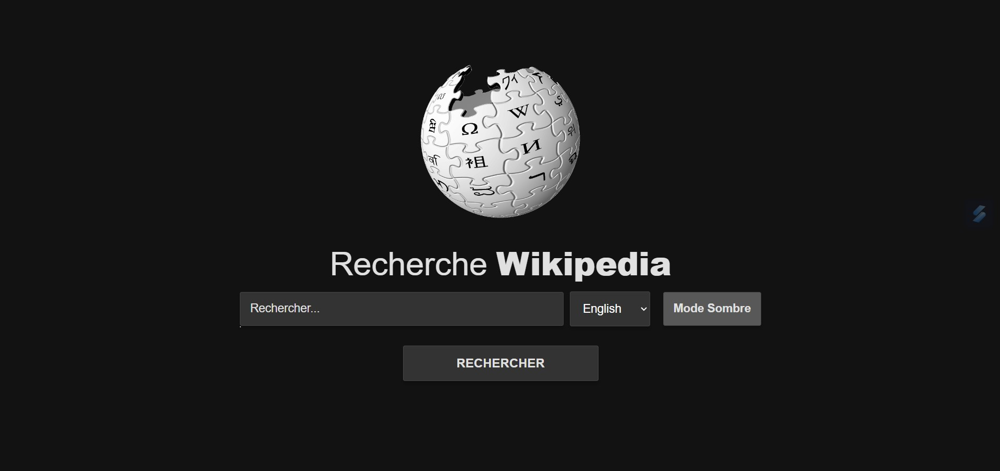

# 🌟 Wiki Search 🌟

 

## 📜 Présentation

Bienvenue dans Wiki Search, une application web élégante et intuitive pour rechercher et explorer des articles sur Wikipedia ! 📚🔍   

 
 

## 🚀 Fonctionnalités Principales

🔍 Recherche Intuitive : Trouvez facilement des articles Wikipedia en saisissant des mots-clés dans la barre de recherche   
💡 Suggestions Instantanées : Obtenez des suggestions de recherche en temps réel pour affiner vos requêtes   
📄 Affichage des Résultats : Découvrez les résultats sous forme de cartes avec des extraits pertinents et des liens directs   
🌙 Mode Sombre : Basculez entre le mode clair et sombre pour une expérience de lecture personnalisée   
📜 Pagination Dynamique : Faites défiler la page pour charger plus de résultats automatiquement   

 
 

## 📸 Aperçu

Voici à quoi ressemble l'application :   

[Démo vidéo du projet 🎥](https://www.youtube.com/watch?v=b6dCankd0wE)

 
 

## 🌐 Lien direct

Pour l'utiliser : [Wiki Search 🌍](https://gabriellepagnard.github.io/Wiki_Search/)

 
 

## 🔧 Technologies Utilisées

- HTML 🏗️    
- CSS 🎨   
- JavaScript ⚙️   

 
 

## 📂 Fichiers du Projet

- index.html : Structure HTML de la page web.   
- style.css : Styles CSS pour l'apparence de l'application   
- app.js : Script JavaScript pour la logique de recherche, la gestion des résultats et les interactions avec l'API    
- ressources/ : Dossier contenant les images et les icônes (y compris le logo Wikipedia et les captures d'écran)   

 
 

## 🛠️ Installation et Utilisation

Pour démarrer avec Wiki Search, suivez ces étapes simples :   

➡️ Clonez le Répertoire :   

`git clone https://github.com/votre-utilisateur/wiki-search.git`   

➡️ Accédez au Répertoire :   

`cd wiki-search`   

➡️ Ouvrez le Fichier "index.html" dans votre navigateur pour voir l'application en action   

➡️ Personnalisez le Code selon vos besoins ou apportez des contributions !   

 
 

## 🏗️ Comment Contribuer

Vous souhaitez contribuer ? 🎉 Voici comment faire :   

### Créer une Branche 🌿

➡️ Pour chaque nouvelle fonctionnalité ou correction, créez une nouvelle branche :   

`git checkout -b nom-de-la-branche`   

### Faire vos Changements ✏️   

Apportez les modifications nécessaires et committez-les :   

`git add .`   
`git commit -m "Description des changements"`   

### Pousser les Changements ⬆️   

Envoyez vos modifications à GitHub 📨 :

`git push origin nom-de-la-branche`   

### Créer une Pull Request 🔄   

Allez sur GitHub, ouvrez une Pull Request et expliquez vos modifications   

 
 

## 🤝 Contributeurs/trices

Gabrielle Pagnard 🧑‍💻 - Créatrice du projet

 
 

## 📧 Contact

Pour toute question ou suggestion, n'hésitez pas à me contacter :   

Email : gpagnard@gmail.com   
GitHub : [GabriellePagnard](https://github.com/GabriellePagnard)     

 
 
 

Merci d'avoir visité le projet Wiki Search ! 🚀   

J'espère qu'il vous sera utile et agréable à utiliser. N'hésitez pas à laisser un ⭐ si vous aimez ce projet !   

 

Wiki Search - Cherchez. Découvrez. Apprenez. 🌍